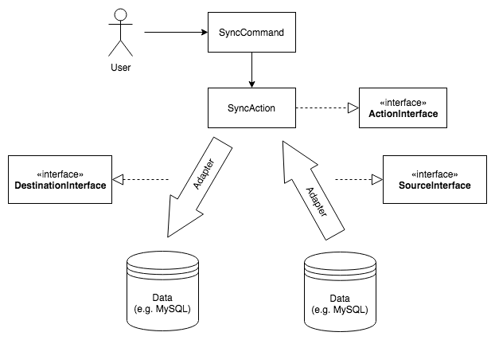

# DataSync

This project is a result as a babymarkt.de Slacktime project by [Arkadius Jonczek](https://github.com/arkadiusjonczek) to synchronize internal development databases. 

You can synchronize your data (e.g. MySQL Databases) using different connection adapters (e.g. JSON-RPC). 

You can use a direct connection to your data (e.g. MySQL Server) or you can use a adapter (e.g. JSON-RPC) if you do not have direct access to your data (e.g. MySQL Server).

The idea was to build an extensible data-sync framework. So you can write custom actions, data drivers and connection adapters.



## Integrations

The data-sync project supports the following drivers and adapters for now.

### Data Drivers

- MySQL

### Connection Adapters

- Direct (PDO)
- JSON-RPC

## Start

Clone the github repository.

```
git clone git@github.com:Baby-Markt/data-sync.git
```

## Configuration

Create a parameters.yml file for the data sync configuration.

```bash
cp app/config/parameters.yml.dist app/config/parameters.yml
```

## Test run

Start server and client docker containers:

```
./server.sh up -d
./client.sh up -d
```

Connect to server and client mysql server:

```
Server: 127.0.0.1:33060
Client: 127.0.0.1:33061

User:     root
Password: root
Database: datasync
```

Start sync from server to client:

```
./sync.sh
```

Shutdown docker containers after tests:

```
./client.sh down
./server.sh down
```

## Start Sync

```bash
php app/console datasync:sync
```

## Debug in PhpStorm

### php.ini

1. Open "docker/server/images/php-fpm/php.ini"
2. Set "xdebug.remote_host" to local ip (use ifconfig)

### PhpStorm

1. Go to "Preferences -> Languages & Frameworks -> PHP -> Debug"
2. Set Xdebug Port to 9999
3. Add PHP Remote Debug Entry
